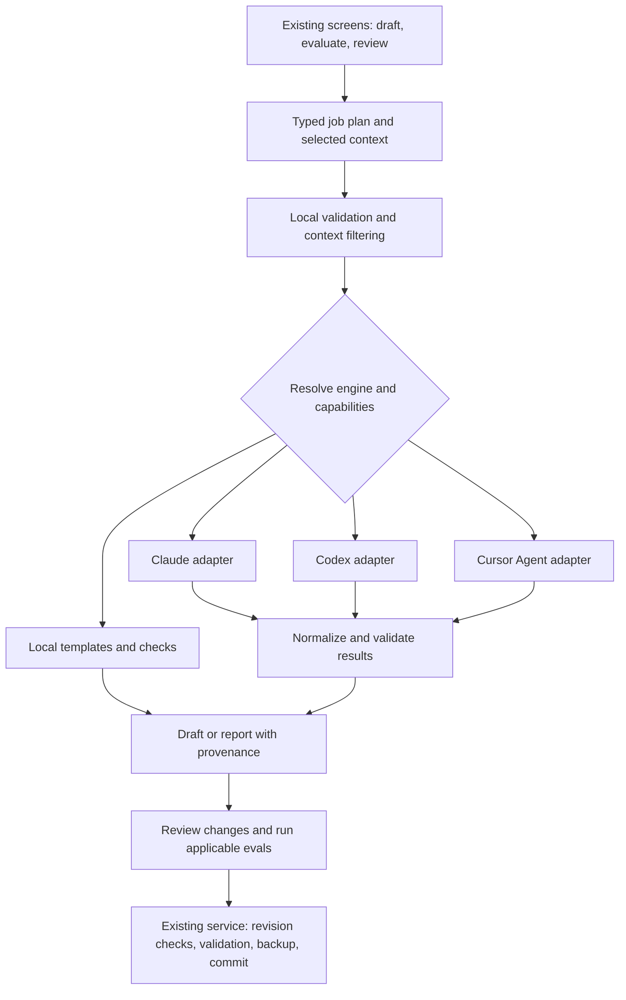

# AI integration across AIOS

Assessment date: 2026-09-11. Reviewed working-tree application version: 1.3.0.

**Recommendation:** build one shared AI runtime for Claude Code, Codex CLI and Cursor Agent, then connect the existing screens to it. Use AI to draft, interpret, compare and recommend. Keep discovery, validation, file operations and measured results under application control. Every AI workflow needs an explicit, useful local mode.

This is a code assessment and implementation specification. The new provider adapters and authoring workflows described below are **not implemented by this document**. This review inspected the active UI and backend, verified installed CLI versions/help, and reproduced a discovery inconsistency in a disposable home. It did not run paid model requests, reauthenticate accounts, change native configurations or deploy a new application. [Machine probes, reproduction and source hashes](ai-integration-2026-09-11/assessment-evidence.json) identify the reviewed state; the deployed download may differ from this working tree.

> Implementation follow-up: the shared runtime and first authoring, evaluation and review workflows have now been implemented. See [implementation status and validation](AI_INTEGRATION_IMPLEMENTATION.md) for delivered scope and remaining boundaries. The assessment below records the earlier source state.

## 1. What the application should become

AIOS already has a useful separation: a local resource manager plus background workspaces. Extend that into a guided resource lifecycle:

1. Describe a goal or select an existing resource.
2. Choose its destination provider and user/project scope.
3. Assemble a bounded context from selected files and stated requirements.
4. Draft with an available AI tool, or use a local template/checker.
5. Validate the native format, inspect the draft and define tests.
6. Measure behavior where an AI engine is available; show local findings separately.
7. Apply the reviewed result through the existing conflict checks and backup transactions.

The **AI engine** and **resource destination** are separate choices. A user may use Codex to create a Claude Code skill, Claude to draft a Codex agent, or Cursor Agent to review instructions used by all three. The top-level resource-provider filter must not silently select the AI engine.

AIOS should reuse the user's CLI authentication and model access. Running a local CLI does not necessarily keep model inputs on the machine: ordinary cloud-backed CLI runs send selected content to the configured model service. Local-only mode should make no model calls.

## 2. Current architecture and integration readiness

The active route is [main.jsx](../src/main.jsx) → [app.jsx](../src/app.jsx) → [workbench.jsx](../src/workbench.jsx), with labs in [labs.jsx](../src/labs.jsx). There are **18 active navigation screens**. Several older standalone page components remain in `src/`; extending those would not update the current application.

| Existing part | What can be reused | What needs to change |
| --- | --- | --- |
| [Lab jobs](../scripts/lib/lab.mjs) and [lab worker](../electron/lab-worker.mjs) | Persisted jobs, cancellation, restart recovery, private workspaces, selected-input copies and retained results | Add typed authoring/review jobs and provider-aware settings/results; preserve old job compatibility |
| [Process runner](../scripts/lib/processes.mjs) | Argument arrays without a shell, bounded output, timeouts, process-group cancellation, stdin and output callback | Share executable resolution with tool detection; introduce provider-specific environments and event parsers |
| [Evaluator](../scripts/lib/evaluator.mjs) | Suite validation, deterministic assertions, paired A/B runs, blind comparisons, holdouts and failure handling | Extract Claude execution from evaluation orchestration; represent provider capabilities, model identity and missing usage data |
| [Service](../scripts/lib/service.mjs) and [storage](../scripts/lib/storage.mjs) | Resource IDs, selected roots, revisions, validation, backups, transaction recovery and transfers | Typed AI context access; revision-bound prompt edits; safe creation of multi-file drafts |
| [Memory checks](../scripts/lib/memory-review.mjs) | Exact duplicate paragraphs, length guidance, relative-reference checks, machine paths and project-scope hints | Supplement with semantic review; retain local observations and distinguish model suggestions |
| [Native formats](../scripts/lib/formats.mjs) and [provider conventions](../scripts/lib/providers.mjs) | Provider-specific formats and scope limits | Generate against these contracts; add a separate AI-provider registry rather than overloading native-resource providers |
| [Electron boundary](../electron/main.mjs) and [preload](../electron/preload.cjs) | Trusted sender checks, operation allowlist, native file dialogs and sandboxed renderer | Add typed operations; never expose arbitrary executable, shell command or unrestricted file access from the renderer |

### Confirmed gaps and their practical impact

The priorities below concern this integration. They are not a claim to have found every application bug.

| ID | Priority | Finding and evidence | Required resolution |
| --- | --- | --- | --- |
| AI-01 | High | `service.mjs:236` detects `cursor`, but does not enumerate `agent` or `cursor-agent`. The editor launcher is not evidence of an installed headless agent. Reproduced in the isolated probe. | Identify Cursor Agent by its CLI identity; recognize and deduplicate both aliases |
| AI-02 | High | `service.mjs:237` omits `~/.npm-global/bin`; `processes.mjs:7` includes it. With a minimal Finder-style PATH, the tool screen misses the disposable Codex executable that the runner finds. | One resolver for readiness and execution, including user-configured executable overrides |
| AI-03 | High | `evaluator.mjs:70–115` selects only Claude, parses Claude result events and requires `total_cost_usd`. Substituting an executable name would break output parsing and budgets. | Separate adapters and a normalized result contract; nullable usage/cost |
| AI-04 | High | `labs.jsx:13–29` and `lab.mjs:44–49` assume a Claude model and dollar budget. Lab selection accepts only skills and memory. | Provider-aware settings and capability checks; add explicit agent/prompt authoring and eval input types |
| AI-05 | High | `workbench.jsx:62–82` creates resources through a manual content editor; `:99–111` does the same for prompts. The existing proposal job edits a selected skill/memory file; it does not create a new resource. | Shared draft workflow, local templates, new-resource validation and reviewed save |
| AI-06 | High | `resources.read` in `service.mjs:275` accepts skills/memory only. Existing redaction in `api.js` targets common JSON fields; it is not a general AI-context scrubber. | Backend context builder for each purpose; config redaction, source mapping and bounded selections before model invocation |
| AI-07 | High | `prompts.save` checks existence but has no expected-revision argument. A future long-running AI proposal could overwrite a newer prompt if directly saved. | Add prompt revision checks before introducing asynchronous prompt edits |
| AI-08 | Medium | `preferences.save` persists only theme, sync interval, exclusions and native provider paths. Extra AI preferences would be discarded. | Backward-compatible settings migration for engines, model choices, fallback policy and limits |
| AI-09 | Medium | Evaluator capability cache is keyed only by executable path. An in-place CLI update can leave stale assumptions for the worker lifetime. | Cache against resolved identity/version/file metadata; invalidate and recheck on replacement |
| AI-10 | Medium | Current security screen lists MCP credential presence and source-file write permissions. It does not semantically review resource content or inspect whole-project code. | Define separate configuration-review and optional selected-code-review scopes |
| AI-11 | Medium | New-file creation is a single-file transaction; packaging expects a saved skill evaluation snapshot. | Add bounded draft-bundle staging/creation for new skills with supporting files; keep text-only creation as the first deliverable |
| AI-12 | Medium | Current runner inherits the application environment with adjustments. A broader multi-provider runner could pass unrelated credentials or hooks to child tools. | Minimize environment per provider, preserve required native authentication, redact errors/logs and test credential boundaries |

## 3. What the three CLIs actually provide

All three CLIs are installed on the inspected machine. This establishes installation and advertised flags, **not** current authentication, model entitlement or verified execution isolation. Other machines must be probed independently; these paths and versions are evidence, not application defaults.

| Engine | Verified local version | Useful interface | Adapter differences |
| --- | --- | --- | --- |
| Claude Code | `2.1.267` | `claude -p`; JSON/JSONL; native JSON schema; tool restrictions; remaining-dollar limit | Current integration exists. Retain its restricted job modes and parser while extracting it behind a common interface |
| Codex CLI | `0.147.0` | `codex exec`; JSONL; schema file; final-output file; ephemeral runs; sandbox options | Parse Codex events/final output. Do not require Claude cost fields. Pin the selected model and verified execution policy |
| Cursor Agent | `2026.04.13-a9d7fb5` | `agent -p`, also `cursor-agent -p`; JSON/JSONL; ask/plan modes; workspace and sandbox options | JSON output is an envelope, not a guarantee that the answer matches our requested schema. Validate extracted answers locally. No schema or dollar-cap flag was advertised by this installed version |

Claude's headless documentation describes structured output and result metadata. Codex documents noninteractive execution with saved authentication, JSON events and output schemas. Cursor documents headless output formats and separate CLI permissions. These are distinct protocols, not interchangeable command names. [Claude headless](https://code.claude.com/docs/en/headless), [Codex noninteractive mode](https://learn.chatgpt.com/docs/non-interactive-mode), [Cursor output formats](https://cursor.com/docs/cli/reference/output-format).

### Capability constraints

- **Claude:** the installed help advertises `--safe-mode`, `--restricted`, `--tools`, `--setting-sources`, `--json-schema` and `--max-budget-usd`. Preserve the current explicit MCP/hook restrictions. Do not switch to `--bare` as a generic isolation shortcut: its authentication behavior differs from the existing login-based flow.
- **Codex:** installed `exec --help` advertises `--ignore-user-config`, `--ignore-rules`, `--ephemeral`, `--sandbox`, `--output-schema` and `--output-last-message`. Ignoring exec-policy rules is not the same thing as ignoring `AGENTS.md`. Read-only sandboxing does not by itself prove bounded reads or absent MCPs/hooks. Candidate profiles need integration tests before being offered as isolated evals. [Codex CLI reference](https://learn.chatgpt.com/docs/developer-commands?surface=cli).
- **Cursor:** print mode can have access to write and shell tools. Do not treat `-p`, omission of `--force`, or JSON output as an isolation boundary. Verify ask/plan behavior, sandboxing, inherited instructions, MCPs and CLI permissions for the installed version. Public documentation currently mentions options such as `--plugin-dir` that this installed build does not advertise. [Cursor parameters](https://cursor.com/docs/cli/reference/parameters), [Cursor permissions](https://cursor.com/docs/cli/reference/permissions).
- **Costs:** Claude exposes a dollar-limit mechanism; it is not a guarantee against all in-flight overrun. A provider with unreported dollar usage must show “Not reported,” never `$0`. Enforce wall time and call counts for every provider. A run requiring an enforceable dollar limit cannot silently use an adapter that lacks it.
- **Native skill activation:** Claude's existing trigger test observes registration and Skill/Read events for an isolated synthetic skill. That is different from testing task output with pasted instructions. Keep native activation tests disabled for Codex/Cursor until equivalent installation, discovery and event evidence are verified. Do not substitute an LLM's opinion that a skill “would trigger.”
- **Authentication:** detect missing/expired login without collecting credentials. Use each CLI's own status/login mechanism, keep login separate from model work, and show an actionable status. Do not copy credential stores into job directories.

## 4. Review of all 18 active screens

“Local” below includes existing behavior and proposed fallback work. Items in the AI column are proposed unless explicitly marked existing.

| Screen | Where AI adds value | Deterministic behavior / local fallback | Order |
| --- | --- | --- | --- |
| **Overview** | Explain discovered issues, summarize recent reviewed changes, suggest the next useful action with links to evidence | Inventory counts, discovery errors, status and selected roots remain measured locally. No AI call on launch or every sync | Later |
| **Skills** | Create from a goal, improve clarity, identify overlap, draft examples and supporting-file plans, suggest tests | Template wizard; frontmatter/name/reference checks; ordinary edit, enable/disable, transfer and export. AI cannot install by writing directly to native paths | First workflows |
| **Skill Lab** | Existing Claude task/A/B/trigger/improve/analyze flows; add engine choice and generation of reviewable test cases | Suite validation, deterministic grading of available outputs, paired statistics and artifact checks. Without a model, fresh behavioral runs are unavailable; local checks and existing reports still work | Foundation |
| **MCP servers** | Explain capabilities/configuration, flag excessive access, propose task-specific selections, draft configuration from supplied verified server details | Native toggles, source-level/project-level plans, syntax checks and profile transactions. Do not invent package names, endpoints or credentials, or infer active-session loading from disk | After authoring |
| **Plugins** | Summarize manifests and declared components, identify overlap, explain visible permissions/dependencies | Discovery and supported reference toggles. Installation stays with the provider. Static review cannot certify a plugin's runtime behavior or supply-chain safety | After authoring |
| **Memory & rules** | Draft new instructions, explain scope/precedence, adapt instruction style for another provider | Native filenames, scope constraints, manual edits, copies/moves, relative-link rebasing and revision checks | First workflows |
| **Memory Review** | Existing optional semantic review/rewrite; add engine choice, evidence-backed contradiction and scope suggestions across selected files | Existing configurable length guidance, exact duplicates, machine paths and broken references. Preserve intentional repetitions and fenced examples. Shorter text alone is not a quality improvement | Foundation |
| **Convert to Markdown** | Optional second step: clean formatting, summarize, extract a schema or draft a skill/reference document from converted text | Keep MarkItDown extraction, managed installation, original bytes and raw Markdown independent of AI. Unsupported extraction must not be hidden by generated content | Later, optional |
| **Config files** | Explain selected keys, propose repairs for ambiguous parse failures, compare conflicting settings, suggest least-privilege changes | Parser diagnostics, existing deterministic header repair, syntax validation, redaction and backed-up save. Never regenerate an entire config when a targeted patch suffices | After authoring |
| **Commands** | Draft reusable task instructions, explain commands and suggest argument validation | Native Markdown/frontmatter templates and checks. Generated shell text is reviewable content; creating a command does not authorize executing it | First workflows |
| **Subagents** | Create role, trigger conditions, boundaries, handoffs and examples; review conflicting responsibilities; draft tests | Provider-specific templates/validation. Codex TOML is rendered locally from a typed draft; do not assume every provider supports the same permissions or nesting | First workflows |
| **Prompt library** | Generate prompts, improve specificity, create variants/test cases and compare outputs | Templates, variable extraction/validation, preview, copy/save and version history. Add prompt revisions before asynchronous changes. Prompts are local library records, not automatically native provider files | First workflows |
| **Security review** | Explain suspicious instruction/command patterns, trust boundaries and excessive permissions; propose targeted remediations with evidence | Existing observations plus typed rule checks. Keep “observed configuration,” “AI suspicion,” and “not assessed” distinct. Whole-project code review is a separate selected scope | After authoring |
| **Context estimates** | Suggest consolidation, shorter instructions, task-focused resource sets and resources potentially in the wrong scope | Current character-based estimate stays visibly approximate; deduplicate physical files. AI cannot infer exact session context, token billing or unloaded remote MCP schemas | Later |
| **External tools** | Usually no model call needed; optional explanation of a concrete failed job | Shared CLI detection, identity/version/capability/auth status, model selection and a bounded connection test. This becomes the diagnostic surface for all AI jobs | Foundation |
| **History & recovery** | Explain a diff or summarize a sequence of reviewed changes | Exact records, backups, source revisions and transactional recovery. AI never decides which backup is authoritative or silently performs recovery | Later |
| **Getting started** | Optional guided creation of a first resource from the user's goal and detected setup | Local walkthrough, examples and provider-specific setup links. Core onboarding works with no AI account or CLI | After authoring |
| **Settings** | No model needed for normal settings; explain a specific configuration issue on demand | AI engine preference, provider/model capability display, context policy, limits, local-only mode, executable overrides, fallback settings; themes and sync remain local | Foundation |

### Cross-screen actions

| Action | AI assistance | Application authority |
| --- | --- | --- |
| Resource transfer/adaptation | Explain incompatible semantics; draft an adapted **copy** when supported native conversion cannot preserve behavior | [Transfer planner](../scripts/lib/transfers.mjs) decides supported formats, destinations, collisions, bundle integrity and undo. A generated adaptation is reviewed and re-evaluated, not labeled a lossless move |
| MCP profiles | Suggest a task-specific set from discovered servers and user-stated needs | Existing preview/apply changes exact IDs and native scopes. No claim that disabling a file unloads an already-running session |
| Search / command palette | Optional intent-to-filter or intent-to-action proposal over known resources | Resolve IDs against current inventory; show the concrete action. Default lexical search remains immediate and free of model calls |
| Export / sharing | Suggest privacy cleanup or a useful description | Backend redaction and user-visible export; exclude secrets from AI input before the model sees it. Keep complete skill bundles distinct from text-only exports |
| Discovery troubleshooting | Explain parser/permission/limit diagnostics and suggest narrower roots | Scan limits, canonical path checks, exclusions and cancellation remain deterministic. AI does not broaden filesystem access or execute discovered commands |
| Statusline / installation / release | Explain an existing script or error when requested | Script generation, dependency integrity, signature checks, builds and deployment verification do not need model decisions in the product |

## 5. Shared runtime design

### Provider registry and readiness

Use a new `scripts/lib/ai/` directory. Keep native configuration conventions in the existing `providers.mjs`.

- `registry.mjs`: resolve `claude`, `codex`, `agent`/`cursor-agent`; verify identity, deduplicate aliases and expose capabilities.
- `claude.mjs`, `codex.mjs`, `cursor.mjs`: build argument arrays, isolate context/tools, parse provider events, normalize errors and usage.
- `runtime.mjs`: resolve preferences, enforce global limits, stream bounded progress, cancel jobs and normalize outputs.
- `context.mjs`: collect selected resource snapshots, redact sensitive fields, enforce byte limits and retain source/line mappings.
- `contracts.mjs`: validate input/output schemas for draft, review, test generation and execution. Provider schema features supplement this validation.
- `local.mjs`: route to deterministic templates/checkers; return the same report/draft envelope with different provenance.

Suggested readiness states: `not_installed`, `incompatible`, `auth_required`, `available_unverified`, `ready`, `temporarily_unavailable`, `policy_blocked`. Readiness is per capability: an engine can support text drafting while file or native-trigger evals remain unavailable.

Probes must not load discovered MCP servers, run project hooks or make paid model calls during ordinary scans. A separate connection test can verify an explicitly selected model. Respect native CLI credential locations and required authentication helpers without persisting secrets in AIOS settings or job records.

Probe flags and versions at runtime; do not ship this machine's paths or assume a model alias is portable between providers. Prefer a provider's model-list interface where available. Otherwise permit a validated user-supplied model ID and show whether it has actually been tested. Never fabricate a complete model catalog or assume subscription entitlement.

### Job and result contract

A job should carry:

- Purpose: `resource.draft`, `prompt.draft`, `suite.draft`, `evaluation.run`, `memory.review`, `security.review` or `config.proposal`.
- Execution choice: engine ID, requested/resolved model when reported, capability profile, limits and fallback policy.
- Destination: resource kind/provider/scope and selected project ID, independently of engine choice.
- Context: selected IDs, immutable revisions/hashes, bounded snapshot references and redaction report.
- Output schema and permitted result kinds. A model returns content/findings, not executable operation names or arbitrary destination paths.

A result should retain:

- Status and provenance (`AI generated`, `local template`, `local check`, `AI review`, `not run`).
- Engine identity/version, requested model, resolved model if reported, prompt-template version and context/suite hashes.
- Draft content or typed findings with validated source IDs/locations; rationale is distinct from observed evidence.
- Actual outputs/artifacts, errors, duration, reported usage and nullable cost with reporting/enforcement metadata.
- Source revision expected at apply time; `review_required` is a workflow state, not permission for the model to mutate files.

Keep existing jobs readable. Missing provider on older Claude jobs can be migrated explicitly to the historical Claude adapter; do not recalculate or relabel their old scores. Record changed limits/policies in new jobs.

### Execution profiles

1. **Text draft/review:** no shell or MCP execution; selected text supplied as data. Prefer tools disabled. A read-only mode alone is insufficient if it can read unselected private files.
2. **File evaluation:** disposable workspace containing only approved snapshots/inputs; writes limited to output workspace; no shell/MCP initially. Release separately per provider after isolation tests.
3. **Native activation evaluation:** provider-specific disposable registration/discovery with observed activation events. It must not install or enable anything in the user's actual configuration.
4. **Command/MCP-dependent evaluation:** a later explicit capability with narrow tool permissions and independent acceptance tests. Do not silently enable it to make an unsupported skill test pass.

Prompts that say “ignore other instructions” are not an isolation mechanism. A CLI adapter that cannot satisfy the required profile must return `unsupported` for that profile. Never add global permission-bypass flags just to avoid an interactive prompt.

## 6. Fallback behavior

Default to **Auto** with a visible selected engine and a user-adjustable preference order. Auto resolves a compatible engine before a job starts. Also offer explicit engine selection and **Local only**. Do not silently send sensitive context to a different engine after the user pinned one.

| Situation | Behavior |
| --- | --- |
| No compatible installed engine | Open the local template/check workflow and explain which AI functions are unavailable |
| Expired login | Preserve work; show native sign-in action and local checks. A login loop is not a model run |
| No entitlement, quota or network | Preserve error and any completed outputs. Offer a new run with another engine or local assistance; do not conceal the failed AI attempt |
| Timeout/cancellation after invocation | Stop children, retain evidence and do not automatically repeat a possibly billed request or start another provider |
| Malformed structured output | Reject it as an engine-response error; a bounded, separately counted repair attempt may be offered. Never accept partial fields as a valid review |
| Unknown cost with strict dollar policy | Mark capability unavailable for that policy; do not report zero cost or pretend to enforce a cap |
| Local checks available alongside AI | Run the applicable checks and display them as local findings, even when AI review succeeds |

### Honest local outcomes

- **Creation:** a guided template populated from the user's answers, with native-format validation. It is useful, but not advertised as an AI-designed artifact.
- **Memory review:** lengths, exact duplicates, references and explicit scope heuristics. Semantic contradictions require review; similar phrasing is not proof of a duplicate instruction.
- **Security:** exact observed permissions, credential-field presence and known suspicious patterns. Do not issue an “AI security score” without AI or certify runtime safety from static checks.
- **Evals:** validation and grading of saved/user-supplied outputs can run locally. With no model there is no fresh model response, behavioral baseline, A/B improvement or model judgment. Show “Not run,” and keep previously measured scores labeled with their original context.
- **Conversion:** the existing local conversion workflow continues in full. Optional AI cleanup produces a separate derived artifact while preserving raw extraction.

If some assertions require AI judges, a local-only pass must not silently drop them and call the remaining subset a complete score. Show check coverage and unavailable assertions explicitly.

## 7. Concrete authoring and review flows

### New skill

**Goal → destination/scope → draft → validate → tests → run → compare → save.**

Ask for purpose, when to use it, inputs, expected outputs, constraints and a few examples. AI produces a complete instruction draft plus a proposed test suite. Start with text-only skills; supporting files use a bounded relative-path manifest and staged bundle transaction in a later increment. Never allow generated absolute paths, path traversal, external symlinks or implicit executable installation.

Review generated tests before running: include positive cases, near misses, failure cases and held-out cases. A new skill has no historical “before” score; choose a legitimate comparator such as the same task without the skill. Existing skills compare the saved original with the candidate. Apply the selected candidate only after normal native validation and conflict checks.

### New subagent

Collect role, delegation conditions, expected results, handoff rules and required capabilities. Generate a typed definition; render provider-specific Markdown/TOML locally. Validate native fields and unsupported capabilities before save. Include task examples and expected boundaries.

Distinguish **instruction quality testing** from **native delegation testing**. Passing tests with the agent's instructions pasted into a model does not prove that its provider will discover, invoke or honor its native permissions. Native behavior needs a separate integration test.

### New prompt

Collect goal, audience, output structure, variables and examples. Produce a draft with declared variables and an editable test table. Reject missing required variable values before a run. Freeze rendered prompt values and revisions in each sample. Provide version comparison through the same evaluation framework, after extending it beyond resource-file IDs.

The save path needs optimistic revision checks, including conflict handling when the user edits a prompt while generation is running. Save variants as separate drafts rather than replacing the original while a job is active.

### Security review

First ship review of selected AI resources: instructions, agent/command definitions, plugin manifests and redacted MCP/configuration entries. Supply native provider conventions and source locations, not unrestricted home-directory access.

Use a structured finding: category, severity, source ID, line/key, evidence, impact, proposed remediation and limitations. Application code verifies the source and whether quoted evidence exists. Separate rule-based findings from model suspicions; do not invent CVEs or package vulnerability status without a current advisory source.

Potential rules/review questions include broad write access, secrets embedded in commands, instructions requesting exfiltration, remote shell downloads, overbroad tool permissions, untrusted input interpreted as instructions, and project-specific instructions placed globally. Expected legitimate uses and false positives must be represented in test fixtures.

Offer a concrete diff for fixes. No model-generated MCP enablement, shell execution, package installation or file relocation should occur as a side effect of reviewing content. Optional repository code review can follow with a separately selected project and bounded code snapshot; it is not covered by the current MCP configuration screen.

### Memory optimization

Keep the existing local checker and guided relocation transaction. AI helps with semantic duplication, contradictory constraints, unclear precedence and extracting project instructions. Every finding points to exact content. Show both files when moving a section and preserve relative-reference behavior.

Compare structural metrics separately from behavioral results: “610 → 380 lines” is an observation; “improved instruction quality” requires relevant tests. Preserve important requirements even if keeping them exceeds the configured line guidance.

## 8. Evaluation integrity across engines

- Freeze the task, suite, selected inputs, candidate/original snapshots, execution profile, engine/model and judge settings for each paired comparison.
- Do not use Claude for baseline and Codex for candidate and attribute the difference to a skill change. Cross-engine benchmarking is a separate matrix with independent paired results for each engine.
- If generation, execution and judging use different engines/models, record all roles. Start with one selected engine per benchmark; add advanced role choices later.
- Keep deterministic assertions visible and prefer them for exact requirements. Use model judgments for subjective criteria, with quoted evidence and an explicit rubric.
- Randomize paired execution and blind A/B label order as the current evaluator does. Preserve repeats and variability; do not imply significance from a tiny suite.
- Keep held-out prompts out of the improvement request. After a user examines and optimizes against holdout feedback, those cases are no longer untouched holdouts for the next optimization cycle; replace or reclassify them.
- A failed/denied run is an execution error, not a failed skill assertion. Incomplete or mismatched pairs have no improvement delta. Keep partial outputs for diagnosis.
- Native activation scores, task pass rates, document-hygiene findings and subjective preference results are different measurements. Avoid a single opaque “AI score.”

## 9. Implementation sequence and acceptance gates

Deliver vertical slices, with existing Claude behavior preserved before broadening capabilities. Do not add separate ad hoc CLI calls in each page.

### Phase 1 — shared engine foundation and existing labs

**Work:** fix AI-01/02; introduce the runtime/adapters, backend schemas/context filtering, readiness UI, persistent settings, provider identity and cost semantics. Migrate existing Claude task/review flows first. Add Codex and Cursor text workflows only after their isolation and parsing gates pass; enable file/trigger profiles individually.

**Done when:** fresh homes with no tools and homes containing each single tool are handled; aliases and minimal PATH work; user-selected engine/model persists; memory and skill jobs use the selected supported engine; no AI launch on scan; old jobs remain readable; unsupported profiles are visibly disabled; errors/cancellation/unknown costs never become scores.

### Phase 2 — authoring and tests

**Work:** shared AI/local draft panel for skills, subagents, prompts and commands; test-suite generation; prompt revisions; explicit input types for prompt/agent instruction evals; source/provider-specific validation; save through the service. Add staged multi-file skill creation after text-only creation is complete.

**Done when:** each engine can draft a supported artifact into each supported native destination; local templates work with no AI; generated tests can be reviewed/edited; output schemas/variables/frontmatter/TOML validate; stale saves fail safely; original resources remain unchanged until apply; real before/after comparisons are retained with provenance.

### Phase 3 — security, configuration and richer memory review

**Work:** structured security report, deterministic rules, redaction and source evidence, targeted config proposals, shared model-backed memory analysis and reviewed fixes.

**Done when:** known-safe and known-risky fixtures produce inspectable findings; secrets stay out of outgoing context and logs; invalid citations are rejected; false positives can be dismissed; malformed configs have readable diagnostics; fixes validate and retain backup/recovery behavior.

### Phase 4 — assistance across the remaining screens

**Work:** optional overview summaries, contextual help, profile suggestions, transfer adaptation drafts, context-reduction suggestions, history explanations and conversion cleanup. Add native agent/skill discovery tests and command/MCP execution only as separately verified capabilities.

**Done when:** these actions operate on explicit selections and do not add startup latency or background spending; findings link to real inventory; converted raw Markdown and transfer originals remain available; unsupported native semantics are reported honestly.

### Suggested code boundaries

| Area | Primary files |
| --- | --- |
| Engine adapters/context/contracts | New `scripts/lib/ai/`; shared resolution in `scripts/lib/processes.mjs` |
| Eval and job integration | `scripts/lib/evaluator.mjs`, `scripts/lib/lab.mjs`, `scripts/lib/job-artifacts.mjs` |
| Settings, prompt revisions, typed context and reviewed apply | `scripts/lib/service.mjs`, `scripts/lib/storage.mjs`, `scripts/lib/formats.mjs` |
| UI | `src/workbench.jsx`, `src/labs.jsx`; extract shared draft/engine controls into focused components |
| IPC and worker progress | `electron/main.mjs`, `electron/preload.cjs`, `electron/lab-worker.mjs` |
| Regression/UAT | Extend `tests/lab.test.mjs`, `tests/service.test.mjs`, `tests/fresh-machine.test.mjs`, `tests/lab-desktop.mjs` and packaged UAT; add adapter contract fixtures |

## 10. Required verification before release

### Automated contract and boundary tests

- Discovery: minimal PATH, executable overrides, spaces/Unicode, non-executable files, broken symlinks, wrong program named `agent`, deduplicated aliases and in-place CLI upgrades.
- Protocols: provider-specific JSON/JSONL fixtures, split multibyte chunks, progress vs final messages, malformed/oversized output, nonzero exits, missing final result and invalid schema fields.
- Limits: missing usage data, strict-dollar capability rejection, total call limits, timeouts, cancellation of descendants, retry behavior and unknown spend after interruption.
- Context: external symlinks, traversal, oversized/binary inputs, credential placeholders, secret-bearing URLs/TOML/Markdown, log sanitization and exact line/source mapping.
- Isolation: canary user/project instructions, MCPs and hooks must not load in isolated modes; attempts to read outside selected context or write outside allowed outputs fail. Test each supported engine/version profile, not just flags in a mock.
- Quality: invalid judge outputs do not pass; failed samples suppress deltas; deterministic and AI-judge coverage stays explicit; holdouts remain out of generation; engine/model changes invalidate comparability.
- Writes: native validation, stale resource/prompt revisions, read-only managed files, name collisions, bundle path rules, partial-transaction recovery, reload/history and undo.
- Fallback: absent engine, expired auth, offline/quota, policy mismatch and local-only settings produce useful, honestly labeled results without silent cross-engine retries.

### Live and desktop UAT matrix

| Scenario | Acceptance evidence |
| --- | --- |
| No AI tools installed | All management/conversion screens usable; local template/check paths work; behavioral eval is clearly unavailable |
| Claude-only, Codex-only and Cursor-only homes | Installed tool recognized; compatible drafting and labs run using that tool; unsupported profiles are explained |
| Multiple engines | Preference and per-job override respected; run records identify the actual engine/model; no silent provider switch |
| Bad skill fixture | Original and candidate measured using the same engine/settings; held-out result shown; apply uses the reviewed candidate and expected revision |
| New skill, agent, prompt and command | AI and local creation paths; native formats, variables, destination/scope and saved discovery verified |
| Security/memory fixtures | Locations and evidence inspected; no destructive edits during review; proposed fix, stale-save rejection and undo verified |
| PDF, DOCX and HTML conversion | Existing extraction regressions pass with no AI; optional cleanup produces separate output without changing input/raw Markdown |
| Long job and app restart | Responsive navigation, meaningful progress, cancel, retained partial evidence and interrupted state |
| Packaged macOS | Apple Silicon and Intel; launch from Finder with minimal environment; fresh home; supported macOS baseline; light/dark/system modes, narrow window and keyboard use |

Existing tests cover many Claude, conversion, transaction and UI boundaries. They must be extended with real adapter transcripts and bounded live runs; prior successful Claude UAT is not evidence that Codex/Cursor integration works. The current package declares macOS 13+; do not advertise compatibility with every historical macOS release.

## 11. Review result

This is a strong direction for AIOS because it connects resource management to creation and measured improvement. The highest-value first delivery is the shared engine foundation plus the existing Skill Lab/Memory Review, followed by skill/agent/prompt authoring. Security/configuration review should use the same runtime and validated evidence contracts.

The main design requirement is truthful behavior: local fallback remains useful, model results remain attributable, and AI proposals become native changes only through the application's existing validation and recovery mechanisms. Neither an AI review nor a passing fixture set justifies a promise that no bugs or security issues remain.
